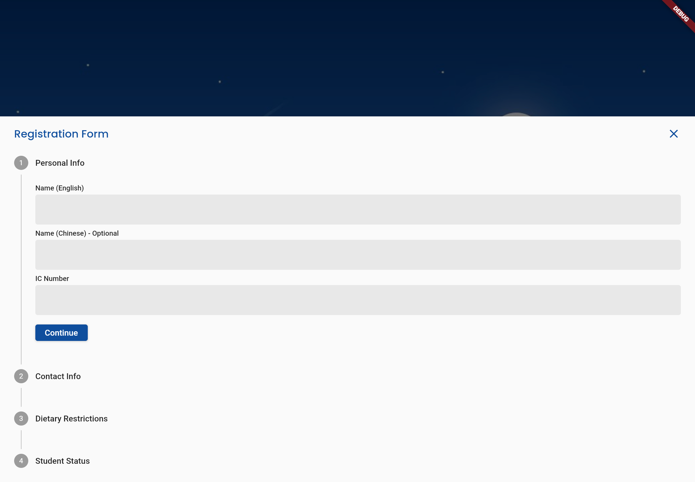

# cw_bsmm
 

This repository stores the source code of a simple event registration website built with Flutter Web. It is used for the registration of CW BSMM Enrolment event. Participants' information are collected from the website and stored in Firebase Firestore. This project is part of Ticketz Event Registration System.

<br/>




<br/>

## Registration Process


<br/>

## Pre-requisites
This project uses the following SDKs:
```
sdk: ">=2.17.5 <3.0.0"
```

Additional information about the Flutter packages used could be found in `pubspec.yaml`.

<br/>

## Folder Structure
The source code of the project is organized in the `lib` directory with the following structure:
```
- components/
    |
    * text_formatter/
        |
        * ic_formatter.dart
    * ui/
        |
        * countdown_group.dart
        * halal_radio_group.dart
        * loading_animation.dart
        * registration_failed.dart
        * registration_form_field.dart
        * registration_form.dart
        * registration_successful.dart
        * student_status_group.dart


- models/
    |
    * attendance_update.dart
    * participant.dart
    * payment_update.dart

- providers/
    |
    * registration_form_provider.dart
    * registration_state_provider.dart

- screens/
    |
    * home/
        |
        * home_page.dart

- services/
    |
    * analytics.dart
    * participant_repository.dart

- shared/
    |
    * constants.dart

- main.dart

- firebase_options.dart

```

<br/>

## Running the project locally
Follow the steps below to run the project on your localhost:
1. Clone the project in a local directory:
    ```
    git clone https://github.com/junsiong2008/cw_bsmm.git
    ```

2. Create a new directory `auth` in the `lib` directory.
    ```
    cd cw_bsmm
    cd lib
    mkdir auth
    ```

3. In the `auth` directory, create a new file called `secrets.dart` and set the `webRecaptchaSiteKey`:
    ```
    const String webRecaptchaSiteKey = '<your-web-recaptcha-site-key>';
    ```

4. Save the file.

5. Go back to the project root directory.

6. Get the Flutter packages:
    ```
    flutter pub get
    ```

7. Run the web application 🎉:
    ```
    flutter run
    ```

<br/>

## Helpful Links
Visit the following sites to learn more:
* [How to implement Google Recaptcha v3 in Flutter Web](https://levelup.gitconnected.com/how-to-implement-google-recaptcha-v3-in-flutter-web-38000139bbc0)
* [Manage Multiple Form Validation in Flutter Stepper](https://stackoverflow.com/questions/57995591/manage-multiple-form-validation-in-stepper-flutter
)
* [Handling API Requests with Flutter Provider](https://maneesha-erandi.medium.com/handling-api-requests-with-flutter-provider-944e3258c5ca)
* [Flutter Provider HTTP POST Request](https://www.dbestech.com/tutorials/flutter-provider-http-post-request-example-with-loading-animation)
* [Firebase GitHub Integration](https://firebase.google.com/docs/hosting/github-integration)
* [Firebase Hosting and Automatic Deployment with GitHub Actions for Flutter Web](https://medium.com/swlh/firebase-hosting-and-automatic-deployment-with-github-actions-for-flutter-web-7713b00fb620)